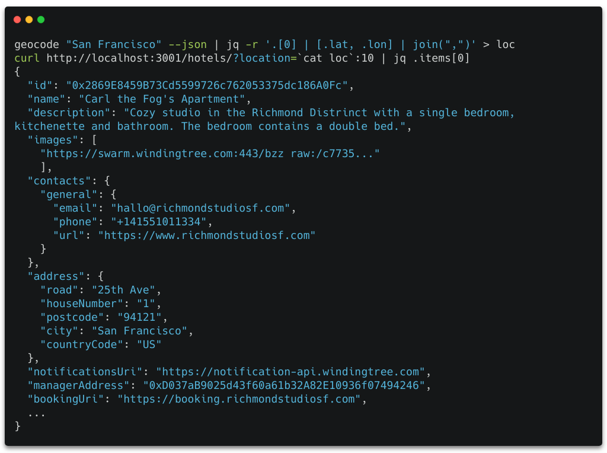
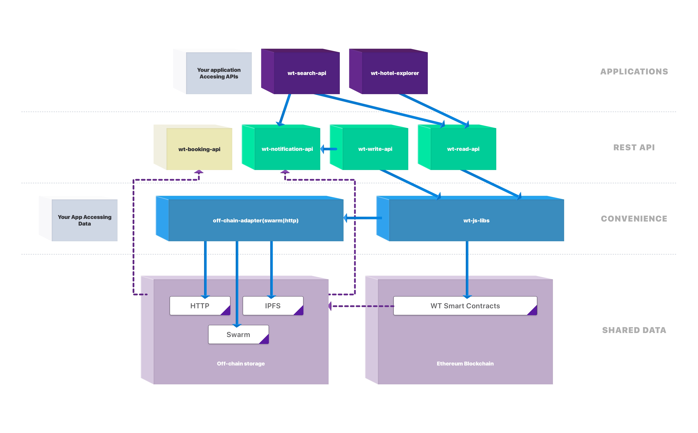

# Getting started with Winding Tree

Winding Tree platform is an open-source platform of APIs connected to decentralized and distributed networks, enabling decentralized travel inventory distribution.

Winding Tree core team maintains [reference open-source implementation of API Servers](/tooling.md) you can run yourself for convenience access to the platform data in the [runtime environments](/tutorials/how-to-pick-environment.md).

**Learn more**

* [How to Publish Inventory Listing](/tutorials/how-to-publish-inventory.md)
* [How to Query Listings](/tutorials/how-to-retrieve-inventory.md)
* [How to Book Accommodation](/tutorials/how-to-book-a-stay.md)

## Platform Functionality

* <a href="/apis/wt-write-api.html#/default/post_hotels" target="_blank">Publishing</a>,
<a href="/apis/wt-read-api.html#/default/get_hotels__hotelId_" target="_blank">retreiving</a>
and <a href="/apis/wt-write-api.html#/default/patch_hotels__hotelAddress_" target="_blank">updating</a>
accomodation provider details, inventory and availability
* <a href="/apis/wt-booking-api.html#/default/post_booking" target="_blank">Booking</a> accommodation products
* <a href="/apis/wt-search-api.html#/default/get_hotels" target="_blank">Querying</a> accommodation by geolocation
* <a href="apis/wt-notification-api.html#/default/post_subscriptions" target="_blank">Subscribing</a> to the event stream and listening to the data updates in the platform

## Architectural Overview

For a more technical deep dive, head to our [wiki](https://github.com/windingtree/wiki).

